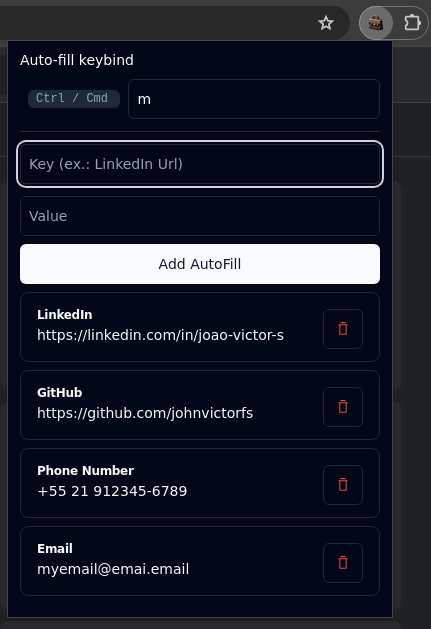

# Job Applications Helper

A Chrome (soon Firefox) that helps you apply to jobs by auto-filling application forms easily.

Create auto-fills with the wanted values



Fill them in form inputs by pressing the keybind setup in the extension


---

### Development

```
# install dependencies
yarn
```

```
# build extension with hot-reloading
yarn dev
```

- Load `dist` folder as unpacked extension in Chrome (TODO: Firefox support)

---

Created using [JohnBra/vite-web-extension](https://github.com/JohnBra/vite-web-extension). [LICENSE](https://github.com/JohnBra/vite-web-extension/blob/2297111d66cce8ade90191cec1b539f6dfbc04cc/LICENSE)
